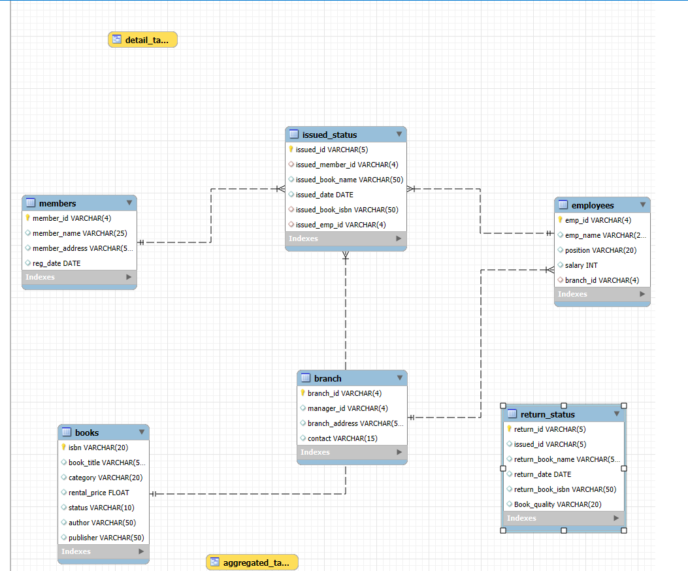

# 📚 Library Management System
### End-to-End Relational Database Project with MySQL


---

## 📌 Project Overview

A fully functional **Library Management System** built from scratch in MySQL — covering database design, relational modelling, constraint management, and a complete set of business queries ranging from basic CRUD to advanced analytics, triggers, and stored procedures.

> **Designed to answer:** *Which books are overdue? Which branches are performing best? Which members are returning damaged books — and which employees are processing the most issues?*

---

## 🖼️ Entity Relationship Diagram (ERD)



---

### Table Definitions

| Table | Primary Key | Description |
|---|---|---|
| **Books** | `isbn` | Book catalogue with title, category, rental price, availability status, author, publisher |
| **Members** | `member_id` | Library members with name, address, registration date |
| **Employees** | `emp_id` | Staff with name, position, salary, branch assignment |
| **Branch** | `branch_id` | Library branches with manager, address, contact |
| **Issued_Status** | `issued_id` | Every book issue transaction — member, book, employee, date |
| **Return_Status** | `return_id` | Return records with date, book name, ISBN, and book condition |

### Foreign Key Relationships

| Constraint | From Table | → To Table | Key |
|---|---|---|---|
| `fk_emp_id` | issued_status | employees | `issued_emp_id → emp_id` |
| `fk_book_isbn` | issued_status | books | `issued_book_isbn → isbn` |
| `fk_member_id` | issued_status | members | `issued_member_id → member_id` |
| `fk_branch_id` | employees | branch | `branch_id → branch_id` |
| `fk_issued_id` | return_status | issued_status | `issued_id → issued_id` |

---

## 📋 Project Tasks

The project is structured into **19 tasks** across 4 levels of complexity.

---

### 🟢 Basic SQL — CRUD & Aggregations (Tasks 1–12)

**Task 1 — Insert a New Book Record**
```sql
INSERT INTO books (isbn, book_title, category, rental_price, status, author, publisher)
VALUES ('978-1-60129-456-2', 'To Kill a Mockingbird', 'Classic',
        6.00, 'yes', 'Harper Lee', 'J.B. Lippincott & Co.');
```

**Task 2 — Update a Member's Address**
```sql
UPDATE members
SET    member_address = '399 Devil St'
WHERE  member_id = 'C101';
```

**Task 3 — Delete an Issued Record**
```sql
DELETE FROM issued_status
WHERE issued_id = 'IS121';
```

**Task 4 — Books Issued by a Specific Employee**
```sql
SELECT * FROM issued_status
WHERE issued_emp_id = 'E101';
```

**Task 5 — Members Who Issued More Than One Book (CTE)**
```sql
WITH CTE_1 AS (
    SELECT issued_member_id, COUNT(issued_id) AS Total_Issues
    FROM   issued_status
    GROUP  BY issued_member_id
)
SELECT * FROM CTE_1
WHERE  Total_Issues > 1;
```

**Task 6 — Total Issue Count Per Book (JOIN)**
```sql
SELECT BK.book_title, COUNT(Isu.issued_id) AS Total_Issues
FROM  issued_status AS Isu
LEFT JOIN books AS BK ON Isu.issued_book_isbn = BK.isbn
GROUP BY BK.book_title;
```

**Task 7 — Book Count by Category**
```sql
SELECT category, COUNT(isbn) AS Total_Books
FROM  books
GROUP BY category;
```

**Task 8 — Total Rental Income by Category**
```sql
SELECT category, ROUND(SUM(rental_price)) AS Rent_Price
FROM  books
GROUP BY category;
```

**Task 9 — Members Registered in the Last 180 Days**
```sql
SELECT * FROM members
WHERE (CURRENT_DATE() - reg_date) <= 180;
```

**Task 10 — Employees with Their Branch Manager (Self JOIN)**
```sql
SELECT Emp1.emp_name, Emp2.emp_name AS Manager_Name, BR.branch_address
FROM       employees AS Emp1
LEFT JOIN  branch    AS BR   ON Emp1.branch_id = BR.branch_id
LEFT JOIN  employees AS Emp2 ON BR.manager_id  = Emp2.emp_id;
```

**Task 11 — Books with Rental Price Above Threshold (CTE + HAVING)**
```sql
WITH CTE_2 AS (
    SELECT book_title, ROUND(SUM(rental_price)) AS Rent_Price
    FROM  books GROUP BY book_title
)
SELECT * FROM CTE_2
HAVING Rent_Price > 7;
```

**Task 12 — Books Not Yet Returned (Three-table LEFT JOIN)**
```sql
SELECT books.book_title, issued_status.issued_id,
       return_status.issued_id AS Return_id
FROM       books
LEFT JOIN  issued_status ON books.isbn = issued_status.issued_book_isbn
LEFT JOIN  return_status ON issued_status.issued_id = return_status.issued_id
WHERE  return_status.issued_id IS NULL
AND    issued_status.issued_id IS NOT NULL;
```

---

### 🟡 Advanced Queries (Tasks 13–18)

**Task 13 — Overdue Books (30-day return period)**

Identifies members who have not returned their book and crossed the 30-day limit — showing member name, book title, issue date, and days overdue.

```sql
SELECT Mem.member_id, Mem.member_name,
       Isu.issued_book_name, Isu.issued_date, RS.return_date
FROM       members       AS Mem
LEFT JOIN  issued_status AS Isu ON Mem.member_id    = Isu.issued_member_id
LEFT JOIN  return_status AS RS  ON Isu.issued_id    = RS.issued_id
WHERE  RS.return_date IS NULL
AND    (CURRENT_DATE() - Isu.issued_date) > 30;
```

**Task 15 — Branch Performance Report**

A four-table join that produces a full branch-level summary: total books issued, total returns, and total rental revenue generated — useful for comparing branch productivity.

```sql
SELECT BR.branch_address,
       COUNT(Isu.issued_id) AS Total_Issues,
       COUNT(RS.return_id)  AS Total_Returns,
       SUM(BK.rental_price) AS Total_Rent
FROM       branch        AS BR
LEFT JOIN  employees     AS Emp ON BR.branch_id      = Emp.branch_id
LEFT JOIN  issued_status AS Isu ON Isu.issued_emp_id = Emp.emp_id
LEFT JOIN  books         AS BK  ON BK.isbn           = Isu.issued_book_isbn
LEFT JOIN  return_status AS RS  ON Isu.issued_id     = RS.issued_id
GROUP BY BR.branch_address;
```

**Task 16 — Active Members (Last 2 Months)**
```sql
SELECT Mem.member_name
FROM       members       AS Mem
LEFT JOIN  issued_status AS Isu ON Mem.member_id = Isu.issued_member_id
WHERE  CURRENT_DATE() - INTERVAL 60 DAY <= issued_date;
```

**Task 17 — Top 3 Employees by Books Processed**
```sql
SELECT Emp.emp_name,
       COUNT(DISTINCT Isu.issued_id) AS Total_Issues,
       MAX(Emp.branch_id)            AS Branch
FROM       employees     AS Emp
LEFT JOIN  issued_status AS Isu ON Emp.emp_id = Isu.issued_emp_id
GROUP BY  Emp.emp_name
ORDER BY  COUNT(Isu.issued_id) DESC
LIMIT 3;
```

**Task 18 — High-Risk Members (Damaged Books > 2 Times)**

Flags members who have returned books in damaged condition more than twice — critical for library risk management.

```sql
SELECT Mem.member_name, Isu.issued_book_name,
       COUNT(Isu.issued_id) AS Damage_Count
FROM       issued_status AS Isu
LEFT JOIN  books         AS BK  ON BK.isbn         = Isu.issued_book_isbn
LEFT JOIN  members       AS Mem ON Isu.issued_member_id = Mem.member_id
LEFT JOIN  return_status AS RK  ON RK.issued_id    = Isu.issued_id
WHERE  RK.Book_quality = 'Damaged'
GROUP BY  Mem.member_name, Isu.issued_book_name
HAVING COUNT(Isu.issued_id) > 2;
```

---

### 🔴 Trigger (Task 14)

**Automatic Book Status Update on Return**

When a new row is inserted into `return_status`, this trigger automatically sets the corresponding book's availability status back to `'Yes'` in the `books` table — no manual update needed.

```sql
CREATE TRIGGER book_return
    AFTER INSERT ON return_status
    FOR EACH ROW
BEGIN
    UPDATE books
    SET    status = 'Yes'
    WHERE  book_title = (
        SELECT issued_book_name
        FROM   issued_status
        WHERE  issued_id = NEW.issued_id
    );
END;
```

> This eliminates the risk of a book remaining marked as unavailable after it has been physically returned to the shelf.

---

### 🔴 Stored Procedure (Task 19)

**Book Issue Management with Availability Check**

Before issuing a book, this procedure checks whether it is currently available (`status = 'Yes'`). If available, it issues the book and flips the status to `'No'`. If unavailable, it returns a clear error message — preventing double-booking entirely.

```sql
CREATE PROCEDURE Book_Issue (
    p_issued_id        VARCHAR(5),
    p_issued_member_id VARCHAR(4),
    p_book_id          VARCHAR(50)
)
BEGIN
    IF (SELECT status FROM books WHERE isbn = p_book_id) = 'Yes' THEN
        UPDATE books SET status = 'No' WHERE isbn = p_book_id;
        INSERT INTO issued_status (issued_id, issued_member_id, issued_date, issued_book_isbn)
        VALUES (p_issued_id, p_issued_member_id, CURRENT_DATE(), p_book_id);
    ELSE
        SELECT CONCAT('The book of ID ', p_book_id, ' Is Unavailable') AS Error_Message;
    END IF;
END;

-- Usage
CALL Book_Issue('IS155', 'C119', '978-0-330-25864-8');
```

---

## 💡 Key Highlights

- Designed a **normalised relational schema** with 5 foreign key constraints enforcing full referential integrity
- Used **CTEs** for readable multi-step aggregations (members with multiple issues, high-rental books)
- Built a **self-join** on the Employees table to resolve manager names within the same table
- Wrote a **three and four-table LEFT JOIN** for unreturned books and branch performance reporting
- Implemented an **AFTER INSERT trigger** to automate book availability updates on return
- Created a **stored procedure** with conditional logic to safely manage the full book issue workflow

---

## 🧰 Tools & Technologies

| Tool | Purpose |
|---|---|
| **MySQL** | Database engine |
| **SQL** | DDL, DML, DQL, TCL |
| **Triggers** | Automated status management on return |
| **Stored Procedures** | Business logic encapsulation for book issuing |
| **CTEs** | Readable multi-step query logic |
| **JOINs** | Multi-table relational queries (up to 4 tables) |

---

## 🗂️ Repository Structure

```
library-management-sql/
│
├── 📄 Library_Management_System.sql   ← Full SQL script (schema + data + queries)
├── 🖼️ ERD.png                         ← Entity Relationship Diagram
└── README.md
```

---

## 🚀 How to Run

1. Open **MySQL Workbench** or any MySQL client
2. Create a new schema: `CREATE DATABASE library_db;`
3. Select it: `USE library_db;`
4. Run the full script: `Library_Management_System.sql`
5. All tables, constraints, data, triggers, and procedures load automatically

---

## 👤 Author

**[Mohammed Ehsan]**
[LinkedIn](https://www.linkedin.com/in/mohammed-ehsan-a90875251/) [GitHub]([https://github.com](https://github.com/Ehzaan))

---

*Built as a portfolio project to demonstrate relational database design and advanced SQL skills.*
